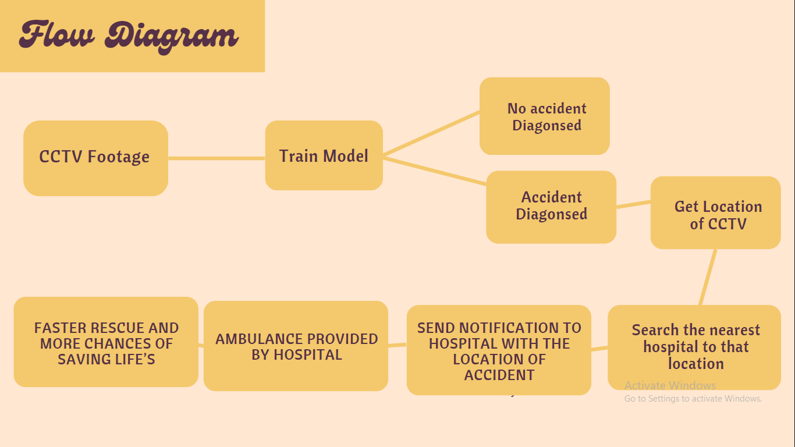

# Safar
# Accident Detection and Emergency Rescue

This project aims to detect accidents in real-time using computer vision techniques and alert emergency services with the location details. The system processes video streams and identifies accident occurrences, subsequently sending alerts to predefined emergency contact numbers and also to the nearby hospitals present, so as to rescue the patient fast.

## Table of Contents

- [Introduction](#introduction)
- [Features](#features)
- [Workflow](#workflow)
- [Dataset](#dataset)
- [Challenges](#challenges)
- [Future Scope](#futurescope)
- [Installation](#installation)

## Introduction

Accident Detection and Emergency Alert System is a project designed to enhance road safety by leveraging computer vision and communication technologies. The system monitors video footage in real-time, identifies accidents, and promptly notifies emergency services with precise location information.

## Features

- Real-time accident detection using computer vision.
- Automatic alert generation to emergency contact numbers.
- Retrieval of nearby hospital locations for immediate assistance.
- Multilingual support for alert messages using Google Translate.

## Workflow

This image illustrates the workflow of the accident detection and emergency alert system.


## Dataset
This is the dataset which we have used to train the model.
https://drive.google.com/drive/folders/1Hj2p4nXilXrG--K7n56YDjXa_egA0p6L?usp=sharing

## Installation

Before running the project, ensure you have the following dependencies installed:

- Python 3
- OpenCV
- TensorFlow
- Requests
- Twilio
- Googletrans

## Challenges

- Finding dataset
- Finding near by hospitals without Google API
- Translating message to regional language without Google translate api
- Training the model to have high accuracy with minimised loss

## Future Scope

- Our goal is to make it user-friendly for seamless integration into various digital platforms, making our solutions accessible to a wider audience
- After seeing how well our tests went in big cities, we're ready to spread our ideas far and wide. We want to reach more people and make a bigger impact with what we've learned.

Clone the repository to your local machine:

```bash
git clone https://github.com/agamgupta2015/safar.git
